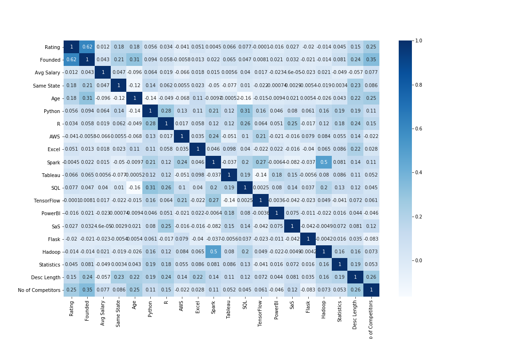

# Data Science Jobs Salary Prediction: Project Overview
- Created a tool that estimates data science salaries in USA to help data scientists negotiate their income when they get a job.
- The aim of the project is to predict Data Scientist salary based on job descriptions
- Scraped over 1000 job descriptions from glassdoor using python and selenium
- Cleaned the data to extract salary, job_roles, skills required (python, r, aws, etc.) and other features
- Explored the data to understand relationship of various features with the target (salary)
- Applied mean-encoding to categorical features
- Optimized Linear, Lasso, and Random Forest Regressors using GridsearchCV to obtain the best model
- Built a client facing API using flask

# Resources Used
**Python Version:** 3.7  
**Packages Used:** Pandas, NumPy, Scikit-learn, Matplotlib, Seaborn, Selenium, Flask, Json, Pickle   
**Web Framework:** `pip install -r requirements.txt`  
**Scrapper Article:**:https://towardsdatascience.com/selenium-tutorial-scraping-glassdoor-com-in-10-minutes-3d0915c6d905  
**Flask Productionization**:<https://towardsdatascience.com/productionize-a-machine-learning-model-with-flask-and-heroku-8201260503d2>

# Web Scraping
Tweaked the web Scraper to scrape 1000 job postings from glassdoor.com. WIh Each job we got the following:
- Job Title
- Salary Estimate
- Job Description
- Rating
- Company
- Location
- Company Headquarters
- Type of Ownership
- Industry
- Sector
- Revenue
- Competitors
- Company Size
- Company Founded Date

# Data Cleaning
After scraping the data from glassdoor.com, I needed to clean it up so that it was usable for our analysis and model building. I made the following changes and created the following variables:
- Parsed numeric data out of salary estimate
- Removed rows without salary estimate
- Parsed company rating out of company text
- Made a new column for Company State
- Created a new column with a condition of whether the work was at the company headquarters
- Transformed company founded date into Age of company
- Created columns for various skills listed in job description
  * Python
  * R
  * Excel
  * AWS
  * Spark
- Created columns for simplified job title and Seniority
- Created column for description length

# EDA
Visually analysed the distributions of the data and the value counts for the various numerical and categorical variables. Below are a few highlights.

 

# Model Building
Built a dataframe for our model with relevant columns.

Transformed the categorical variables into dummy variables. In addition, splitted the data in train and test set

Performed Regression analysis using Linear Regression, Lasso Regression and Random Forest.
  -**Multiple Linear Regression**- BaseLine for the model
  -**Lasso Regression**- As there was sparcity associated with categorical data, in my view these models match well
  -**Random Forest**- Again, with the sparcity associated with the data, this model was chosen
  
 # Model Performance
 - **Random Forest**: MAE = 24.23
 - **Linear Regession**: MAE = 25.75
 
 # Productionization
 In this step, Flask API endpoint was built and hosted on a local webserver. The API endpoint takes a request with list of values from a job listing and returns an estimarted salary.
 
 # Conclusion
 A end-to-end machine learning project for predicting the Salary for Data Scientist Job was developed starting from collection of data, data cleaning, eda, model building, model deployment.

 

